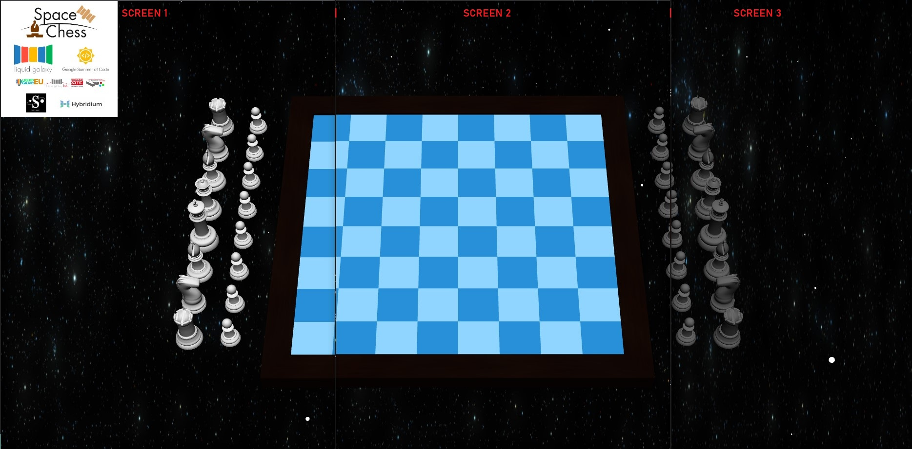

[]()
[]()
[](https://github.com/PabloSanchi/SpaceChessScreens/issues)
[]()

# IMPORTANT NOTE
This is only a brief description and installation guide.<br>
[Full project documentation here!](./assets/Documentation.pdf)

# 🚀 SPACE CHESS

A Newspace related visualization project in collaboration with Hydra-Space.    
The basic idea is to use the Liquid Galaxy cluster as a visualizer of a world chess game that will happen with people around the world and through satellite communications, a world&apos;s first !!!

Two teams, the Earth (🌎)(you) and the Space (🛰️) (a strong AI) <br/>
Every day the Earth makes one move (at least), the most common move among you all, so play as a community and
not as an individual.

Once the Earth has made the move, wait for the Space.
The satellite may take a while to make its move, so you may not see it in hours, be patient.

<p align="center">

</p>


## <a name="req" ></a>✏️ Requirements

1. Make sure the Liquid Galaxy core is installed. Check out the git hub [repository](https://github.com/LiquidGalaxyLAB/liquid-galaxy)
2. Make sure **Node.js version 16** is installed on the master machine by running:
```bash
node -v
```
-  The output should look something like `v16.*.*`, at least you need version `v14.*.*`, if this is not the case it may not work, if not, try upgrading to version 16.

1. Install pm2 on the master machine. Run command:
```bash
sudo npm i -g pm2
```
4. Make sure Chromium Browser is installed on all machines.


## 🖥️ Installation & Launch

### Install Space Chess
- Open a new terminal and go to the '~' (default) directory with the command:
```bash
cd ~
```

- clone the repository **in the current directory (default directory on the terminal)** of the **master** machine with the command:
```bash
git clone https://github.com/PabloSanchi/SpaceChessScreens
```

- Go to the new folder (GitHub repository) and execute the installation script.
Use the following commands **(you will have to restart your computer after the installation is done):**
```bash
cd SpaceChessScreens
bash install.sh
```

- Now execute the following command:

  - ```bash
    ssh -o TCPKeepAlive=yes -R 80:localhost:8120 nokey@localhost.run
    ```
  - You must enter `yes` when asked `Are you sure you want to continue connecting (yes/no)?`

- <a name="env" ></a> Ask the owners for the `.env` file, otherwise the connection throughout the IP wont work.

- INSTALLATION FINISHED!

### Launch Space Chess

You must be in the repository directory, 
Your terminal must look something like this: ` SpaceChessScreens $`

#### Option 1
- Execute the launch script, by doing the following:
```bash
bash open-chess.sh
```
#### Option 2 (If option 1 does not work)
- Execute the auxiliary launch script, by doing the following:
```bash
bash open-chess-aux.sh NUMSCREEN
```
*NOTE: NUMSCREEN is the number of screens that your cluster has.*
*The default value is 5*


<!-- ***WARNING ⚠️:
NUMSCREEN is the number of screens that you want to use.***

***The deafult value is 5. Make sure to set it properly according to your rig setup.*** -->


## 🆘 Troubleshooting

[1.0] Installation errors<br/>
[2.0] Launch errors<br/>
[3.0] Connecting issues<br/>
[4.0] Shh tunnel not working

### Solution
[1.0]
If something went wrong during the installation, the main cause is that you do not satisfy the requirements. Please make sure to check the [requirement area](#req).

[2.0]
If you are experiencing some errors while executing the `open-chess.sh` script, kill it and restart it.
- Stop the server
  - Kill all related running terminals
- `bash kill-chess.sh`
  - You must be in the SpaceChessScreens folder
- `bash open-chess.sh`
  - You must be in the SpaceChessScreens folder

[3.0]
If you cannot connect using the rig modal on the web, [renember to ask the owners for the `.env` file](#env)

[4.0]
If the ssh tunnel is not working then swith to ngrok tunnel.
Add a ```b``` next to the launch script

```bash
bash open-chess.sh b
```
OR
```bash
bash open-chess-aux.sh NUMSCREEN b
```

When using ngrok, you must access to the link before connecting, otherwise you wont be able to connect.
To access the link, you can enter in your web browser 
```
http://MACHINE_IP:8120
```
That will show you the url you must access to. Copy it, and enter it in a new browser tab. You may need to accept some Chrome's warning and then hit the blue button that says `visit site`, after that you will be able to connect to the screen using the web controller by entering the MACHINE_IP

MACHINE_IP is the IP of the master screen.


## Keyboard Controls (test only)
- ZOOM: **w** & **s** keyboard keys
- AXIS Movement: **a** & **d** keyboard keys

## Web Controller (test only)
Type on your browser the following url<br/>
- MASTERIP:port/controller
  
Example:
```bash
http://192.168.0.11:8120/controller
```


<p align="center">

</p>


## 📺 Final view (3 Screen example)
<p align="center">

</p>

